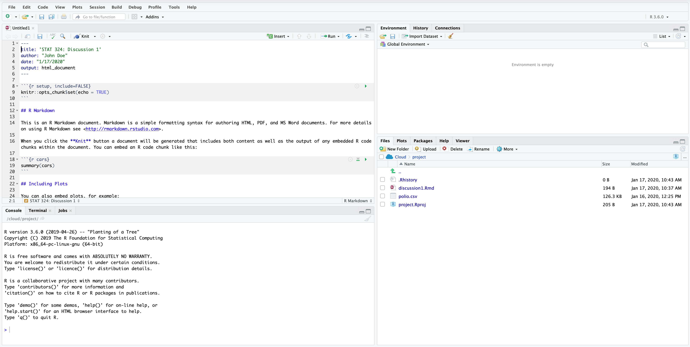

```{r echo = FALSE, message = FALSE, warning = FALSE}
knitr::opts_chunk$set(fig.align = "center")
setwd(here::here("Discussions/disc01"))
```

## Preface

* We will **NEVER** need to actually open `R` itself - always work through RStudio
* We won't deal with `R` scripts. Instead we will use what is known as R Markdown, which is a simple way of including `R` code, `R` output, and text in the same document.

## Getting Started 

### Installation

See canvas announcement about installation of `R` and RStudio. 

### RStudio

When you first open RStudio, you will be presented with something like this:

```{r echo = FALSE, out.width = "470px"}
knitr::include_graphics(path = "screenshots/intro_screen.png")
```

To get started with a new document, click the R Markdown document in the dropdown menu:

```{r echo = FALSE, out.width = "470px"}
knitr::include_graphics(path = "screenshots/new_document.png")
```

The first time you do this, a pop-up box will tell you you do not have the needed packages installed. Just click yes/ok/whatever it says. This will install everything you need.

Next, a pop-up menu will be displayed. Here you will give your document a title, and put your name down as the author of the document. I will let you decide if you want to final document to be an html or pdf file. If you choose pdf, there are a few more steps (see [here](#pdf)). Pdf files look better, but are sometimes also a bit harder to work with. With html files you are more free to focus on the content -- no worrying about page breaks and other annoying things. 

```{r echo = FALSE, out.width = "470px"}

```

Clicking OK will open a new document ("Untitled1") with an R Markdown template. The first part of it is called the yaml header, and is enclosed by `---`. Here we can specify different options. You will see that the title you chose before is already there as is your name, the date, and the output format you chose. If you ever change you mind about any of these, you can change it right here.

```{r echo = FALSE, out.width = "470px"}

```

Looking at the screenshot above, you will see four panels. These are:

* Top left: your document. This is where you will be working most of the time.
* Bottom left: the console. This is where R code is actually run. If you need to install packages, or quickly try something simple, this is where you'd do that.
* Top right: any data sets, variables, etc. that we define in our working session will pop up here. Very neat to keep track of what's going on.
* Bottom right: any plots or help pages will show up here. 

The most important parts are on your left hand side (the document and console). 


### R Markdown

The R Markdown document consists of three main parts: 

1. The header
2. Text (more specifically, markdown portion)
3. R code chunks

We've already mentioned the header -- it is the bit between the `---` at the top of the document.

Text is simply everything that is NOT an R chunk.

R chunks are where we write our code. This will be run and the output shown below it once we knit our document (more on this in a second). A code chunk starts with ` ```{r} ` and end with ` ``` `. RStudio will help us keep track of code chunks by greying them out slightly. To get a new code chunk, you can either type out the beginning and end as mentioned, click `Insert -> R` at the top right of the document panel, click `Code -> Insert Chunk` at the top of the window, or use the keyboard shortcut `Cmd/ctrl + Alt + I`.

When not inside the code chunk, you are basically just writing text. There are a bunch of different things you can do in terms of formatting. We will introduce these as we go along.

### R

`R` is an incredibly powerful statistical software. Its main strength is the incredible community that constantly develops packages, which we can take full advantage of. A few of the ones we will use are `ggplot2`, `dplyr`, and `tidyr`. These are all part of a bigger picture often refered to as the `tidyverse`. Quite conveniently, they are all bundled together into one big package called... `tidyverse`. So to install these, we can simply install this package. Do this by running the following bit of code in the console:

```{r eval=FALSE}
install.packages("tidyverse")
```

Once installed, we can use it. But before we can use it, we need to tell R that we want to use is. We usually do this as the first thing in our document. Delete everything after the header in your document, insert a new code chunk, and write `library(tidyverse)` in it. Include a line above this that explains what you are doing. The result should be something like this:

```{r echo = FALSE, out.width = "470px"}
knitr::include_graphics("screenshots/load_tidyverse.png")
```

To run this code, place the cursor on the line, and hit `Cmd/ctrl + Enter`. Notice how the line is copied to the console! This indicates that the line has been run. There's also a bunch of output. Don't worry about this. 

Now, `R` can obviously be used as a basic calculator (go ahead and write `2+5` in the console, hit enter, then try `sqrt(9)`). This is unbelievably uninteresting. `R` is meant to be used for data analysis, which is exactly what we will use it for! I strongly believe in "learning by doing", so instead of going through all the boring steps that most "`R` Tutorials" do (you can find literally hundreds of these if you are interested!), we will take a look at some actual data!

A big part of using `R` is using the appropriate functions. `R` comes with a bunch of built in functions, such as `mean`, `sd`, `length`, and `sum`, and all the packages we load add to the long list of available functions. 

Take a look at the following, and see if you can guess what the output would be

```{r eval = FALSE}
mean(c(1, 2, 3))
length(c(3,2,1,8,5,2,9,5))
sum(c(1,1,1,2))
```

## Our First Analysis

The objective here is for you to create a very preliminary data analysis. I will provide all the code you need, but you will need to copy it all into your own document, include text around it to describe what it does, and comment on the results. As we go along, I will ask you some questions. Write your answers in your document.

### Load packages

We load the `tidyverse` package. 

```{r message = FALSE}
library(tidyverse)
```


### Import Data

We will use a data set containing data about polio in the US with data from 1938 to 2011. Before we can use the data, we need to read it into `R`. Since this data is provided as a .csv file, we do so using the `read_csv` function:

```{r}
polio <- read_csv("polio.csv")
```

This will save the data as an object called `polio`. Once you've run the code, you'll see that it shows up in the top right panel:

```{r echo = FALSE, out.width="470px"}

```

### First look at data

If you click the object, you will be able to see it in the top left panel:

```{r echo = FALSE, out.width="470px"}

```

You can now answer the first two questions. Once you have answered these questions, save your document, and click the knit button. A much better looking document should appear. This is what you will have to hand in for your homework!

As you work on your document, you will want to knit every so often to make sure you are not making mistakes along the way. 

### Some summaries

The first thing one could be interested in could be the mean number of cases a year. In other words, we want to calculate the mean of the `count` column. To do so, we simply use the `mean` function:

```{r}
mean(polio$count)
```

As you can see above, you can use `$` to extract a single column of your data. 

Now, the truth is that this is not very informative. What would be much more informative would be to find the mean for each year. There are many ways of doing this. One way would be to *group* the data by `year`, then *summarize* it:

```{r}
measles_grouped <- group_by(polio, year)
summarize(measles_grouped, mean_count = mean(count))
```

This quickly becomes hard to keep track of. You have to constantly come up with new names for the intermediate steps, and when the analysis is a bit more convoluted than this example, it becomes both hard to come up with names, and hard to keep track of what object has what information. 

Luckily, there's a rather simple solution to this. It's called the pipe, and the symbol is `%>%`. (Keyboard shortcut: `Cmd/ctrl + shift + M`.) What this does is it takes the output of what is before it, and sends it to the first argument of the function after it. 

An example: the following three lines of code are the same:

```{r}
sqrt(7)

7 %>% sqrt

3 %>% 
  sum(4) %>% 
  sqrt
```

So are the following three. 

```{r}
sum(2,1,7,-6,2)

c(2,1,7,-6,2) %>% sum

c(2,1) %>% 
  sum(7,-6, 2)
```

We can use this to simplify the code above:

```{r}
polio %>% 
  group_by(year) %>% 
  summarize(mean_count = mean(count))
```

What this does is it takes our data (`polio`), groups it by year, then summarizes (within each group) by calculating the mean of the count column. The way I usually think about it is that it chops up our data into small data sets (one for each year), and then basically runs `mean(count)` for each data set. 

We can also use this to calculate the overall mean -- we simply don't group the data. Notice how this is the same as what we calculated above.

```{r}
polio %>%
  summarize(mean_count = mean(count))
```

It's really cool, because we can easily modify this so it works on a per state basis instead of per year:

```{r}
polio %>% 
  group_by(state) %>% 
  summarize(mean_count = mean(count))
```

Comparing these doesn't make much sense -- obviously states with larger populations will have a higher count. So, instead of using the counts directly, we turn them into rates. We do this using the `mutate` function. This mutates the data by creating new variables. For example, to calculate the rate we can do this:

```{r}
polio %>% 
  mutate(rate = count / population)
```

Notice how the data now has 7 columns (i.e. variables) instead of 6. You can check a few, if you'd like, to make sure that rate is indead count per population (`count / population`). 


This can be directly piped into the `group_by` and `summarize` functions:

```{r}
polio %>% 
  mutate(rate = count / population) %>% 
  group_by(state) %>% 
  summarize(mean_rate = mean(rate))
```

Notice what happened to Alaska. We didn't get a number, but rather it simply writes `NA`. This is `R`'s way of telling us something is missing, or 'Not Available'/'Not Applicable'/'No Answer'. Wonder why? Let's take a look at just Alaska:

```{r}
polio %>% 
  filter(state == "Alaska")
```

We simply don't have data for the population in Alaska until 1960. Something similar is the case with Hawaii. We will simply exclude these two states from our futher analysis. To do so, we use the function `filter` together with `!=` (which means "not equal"). We also create the new variable `rate` 

```{r}
new_polio <- polio %>% 
  filter(state != "Alaska", state != "Hawaii") %>% 
  mutate(rate = count / population)

new_polio
```

```{r}
new_polio %>% 
  filter(state == "Wisconsin", year == 1993)
```

Now we have the rate for each state for each year. Which state has had the highest average rate of polio over the years? We can use `arrange` to basically sort the data by `mean_rate`:

```{r}
new_polio %>% 
  group_by(state) %>% 
  summarize(mean_rate = mean(rate)) %>% 
  arrange(mean_rate)
```

By default, it is sorted in increasing order. Luckily it is easy to change it to decreasing: 

```{r}
new_polio %>% 
  group_by(state) %>% 
  summarize(mean_rate = mean(rate)) %>% 
  arrange(desc(mean_rate))
```

One thing that could be interesting to look at is how the rate of polio has changed over the years. To do so, we calculate the mean rate per year:

```{r}
new_polio %>% 
  group_by(year) %>% 
  summarize(mean_rate = mean(rate))
```

This long table of numbers is kind of boring... Let's create a plot! First, we will need to save the mean rates in a new object:

```{r}
mean_rates_per_year <- new_polio %>% 
  group_by(year) %>% 
  summarize(mean_rate = mean(rate))
```

We then use the function `ggplot` to create a plot. We need to tell this function a few things:

1. what data set to use
2. what aesthetics to use (`aes`)
3. what kind of plot we want

```{r}
ggplot(mean_rates_per_year,
       aes(x = year, y = mean_rate)) + 
  geom_point()
```

We could also have done this using a line instead of points:


```{r}
ggplot(data = mean_rates_per_year,
       aes(x = year, y = mean_rate)) + 
  geom_line()
```

Something definitely happens around 1955. Turns out the polio vaccine became widely used in 1954:

```{r}
ggplot(data = mean_rates_per_year,
       aes(x = year, y = mean_rate)) + 
  geom_line() + 
  geom_vline(xintercept = 1954)
```

This was all combining all states. If we use the original data set, we can create the same plot, but with one line for each state:

```{r}
ggplot(data = new_polio, 
       aes(x = year, y = rate, color = state)) + 
  geom_line() + 
  geom_vline(xintercept = 1954, color = "red")
```

This is obviously not very useful. A much better way to present this data:

```{r}
ggplot(data = new_polio,
       aes(x = year, y = state, fill = rate)) +
  geom_tile(color = "grey") +
  scale_fill_continuous(trans = "sqrt")  + 
  geom_vline(xintercept = 1954, color = "red")
```

## Take-aways

* import data using `read_csv``
* extract single column using `$`
* create new variable using `mutate` and simple (or complicated, if you'd like) math
* calculate values per state/year using `group_by` and `summarize`
* filter data using `filter`
* create plots using `ggplot`
    * need to specify data, aesthetics, and type of plot (`geom_*`)

What's next? Discussion 1 and homework 1 will be exactly the same exercise, just with a different disease. Hopefully repetition will help you understand better what's going on.

## PDF

To get a pdf out in the end, you will need to install a few more pieces. To do so, run the following lines of code in the console:

```{r eval = FALSE}
install.packages('tinytex')
tinytex::install_tinytex()
```

**DISCLAIMER**: this does not always work right away, and might take a few extra steps. If you're having issues, you can simply revert to using html as the output. If you really want to get it to work, ask Ralph. 