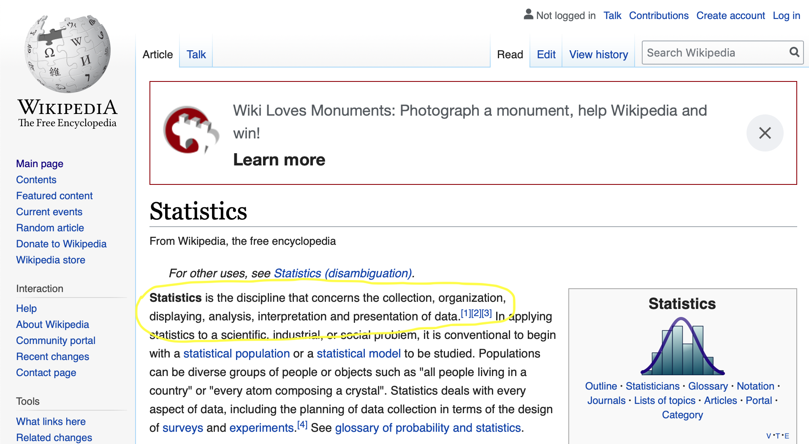
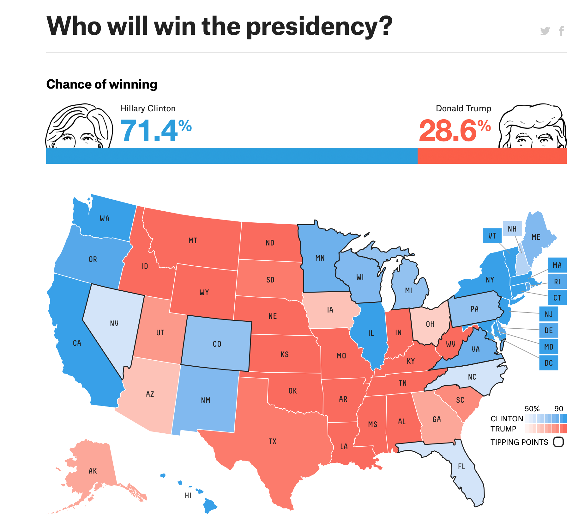
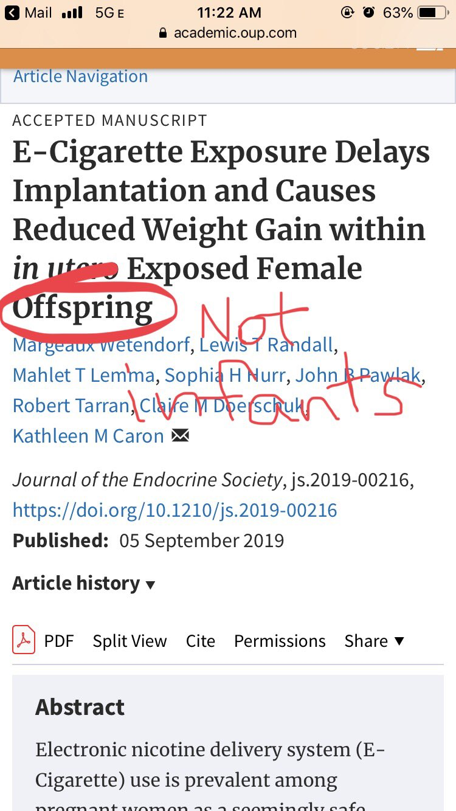

```{r include = FALSE}
knitr::opts_chunk$set(echo = FALSE, warning = FALSE, message = FALSE, dpi = 300)
```

# Wrap up lecture 1

Re: homework:

* Submission: Knit to html -> go to canvas -> upload .html file
* Homework 1 will be assigned later today, and will be due at 6pm next Thursday

--

Important point about R Markdown I forgot to mention: 

* When you knit, you start from scratch!

--

Misc:

* Please take the survey

* Learning Center

* Updated office hours on Canvas

---


# Objectives for Today

1. Expectations

2. "Define" statistics

3. Why is statistics important? A.K.A. why you should care...

4. Broad overview of STAT 324

---


# Before we get started...

... let's clear the air. 
--
 Based on my personal experiences most of you think statistics is boring. 

So I expeect a lot of this...

.center[

]

---

# Before we get started...

... let's clear the air. Based on my personal experiences most of you think statistics is boring.
 
My prayer to you: give us a chance! 

--

Take a leap of faith...

.center[

]

... I promise you won't get hurt!


---

# Expectations

We will give you...

... basic knowledge of statistics and probability

... some foundational knowledge of the theory behind statistics, enabling you to learn additional methods in the future

... the ability to summarize data graphically and numerically

... the ability to identify and perform appropriate analyzes for some simple data sets

... functional skills using `R`

--

You should **NOT** expect a flow chart called "how to perform the perfect statistical analysis".

---

# Expectations

We expect that you...

... participate in lecture and discussions

... spend time on your homework and use it as a *learning experience*

... ask us questions instead of giving up

--

We do **NOT** expect you to be a completely self-sufficient data analyst by the end of this course.

---

# What is Statistics?

Statistics is... 
--
very hard to define. 

--

From Wikipedia: 

.center[

]

--

So it seems that statistics is everything that has to do with data...?


---

# What is Statistics?

<div class="middlecenter">
  STATISTICS IS NOT AN EXACT SCIENCE!!
</div>

--

To me, it is more accurately described as a *decision science*.

--

Very unfortunate misconception. Lead to terms as "statistically significant", arbitrary cutoffs used as THE way to determine importance, etc. 


---
layout: true 

# Why you should care

---

These days, statistics is all around us, but most have problems with even simple things, such as interpreting a probability.

--

.center[
  
]

---

Too often studies are misrepresented.

.center[
  
]

---

Too often studies are misrepresented.

.center[
  
]


---

People get away with bad practices (on purpose or accidentially): 

.center[
  
  Full paper (from 2009) can be found [here](https://www.ncbi.nlm.nih.gov/pmc/articles/PMC2685008/)  
]

???

This wouldn't happen as often if more people were "statistically literate"

---

</br>

</br>

</br>

</br>

My point is: whether you'll be producers or consumers of statistics, it's important to have a basic understanding of what's going on.

---
layout: true

# Statistics in STAT 324

---

Generally speaking, there are two kinds of statistics:

* descriptive

* inferential

We will mostly consider inferential (this is by far the more difficult and more fun of the two!)

---

## Descriptive Statistics

Reduce data to a few key take-aways

This is what people usually think about when they hear the words "statistics"

* means, medians, quantiles, etc.
* variances, standard deviations, etc.

This includes things like sports statistics, census information. 

Descriptive Statistics can take the form of graphical and/or numerical summaries of the data. 

???

batting averages, free throw percentages, completion percentages, etc.

population size, unemployment rate, etc.

---
layout: true

# Statistics in STAT 324

## Inferential Statistics

---

Where descriptive statistics aim at *describing* the data at hand... 

--

... inferential statistics aim at *inferring* information about a *population* based on the data at hand (the *sample*)

.center[
```{tikz echo = FALSE, out.width = "560px"}
\begin{tikzpicture}
  \node[align=center] at (0,11) {\huge \bf Population};
  \draw [thick] (0,0) to [out=0, in=-90] (4.5,4)
                      to [out=90,in=-90] (3.5,8)
                      to [out=90,in=0] (2,10)
                      to [out=180,in=0] (0,9)
                      to [out=180,in=0] (-3,10)
                      to [out=180,in=90] (-5,7)
                      to [out=-90,in=90] (-4,5)
                      to [out=-90,in=90] (-5,2)
                      to [out=-90,in=180](0,0);

  \node[align=center] at (6.25,9) {\large SRS};
  \draw [thick,->] (4,8) to [out=25,in=155] (8.5,8);

  \node[align=center] at (10,11) {\huge \bf Sample};
  \draw [thick] (10,8.5) to [out=0,in=135] (11,8)
                         to [out=-45,in=100] (12,7)
                         to [out=-75,in=90] (12.5,5)
                         to [out=-105,in=0] (11.25,4)
                         to [out=180,in=0] (9.5,4.25)
                         to [out=180,in=0] (8.5,4)
                         to [out=180,in=-90] (8,4.5)
                         to [out=90,in=-90] (8.25,5.25)
                         to [out=90,in=-165] (8.5,7.5)
                         to [out=0,in=180](10,8.5);

\end{tikzpicture}
```
]

---


In the begining, there is a hypothesis: "Cigarette smoking causes lung cancer".

--

* Very vague, hard to verify or dismiss

--

More specific: "People who smoke cigarettes have a higher incidence of lung cancer over a 10-year period than people who do not smoke cigarettes."

--

* Clear what it means to "cause lung cancer" -- higher incidence 

---

Say we wanted to answer this question. Only one way to obtain the "Truth&trade;". It's a simple three-step procedure:

--

1. Ask the people in your population of interest if they have ever smoked, and if they have developed lung cancer. 
--

2. Calculate incidence rates
--

3. See which is larger
--

.center[
Rejoice in newfound knowledge!


]

---

Say we wanted to answer this question. Only one way to obtain the "Truth&trade;". It's a simple three-step procedure:

1. Ask the people in your population of interest if they have ever smoked, and if they have developed lung cancer. 

2. Calculate incidence rates

3. See which is larger

.center[
Unfortunately, this is basically impossible!


]

---

What do we do instead? Inferential Statistics!

--

1. Define the population(s) you're interested in, and specify the feature you'll be looking at
  - populations are people who smoke, and people who do not
  - feature of interest would be incidence rate

2. Get a representative sample from the population
  - preferably sample by random from the two populations

3. From the sample, calculate quantities (i.e. "things") that can help you say things about the "truth"
  - when interested in the incidence rate, simply calculate the incidence rates in the samples

--

The thing is, the samples won't mirror the populations *exactly* -- take a new sample, get new estimates.

--

The question is then: is the difference due to "differences in the truths", or is it simply "differences due to random samples"?


???

- The "fundamental assumption" of statistics: there is a "truth" in the population
- The "fundamental idea" of statisitcs:  take sample, work with sample, if sample is similar to population we can do inference
- If the difference is "big enough", fair to say it is due to differences in the truths

---
layout: true

# Statistics in STAT 324

## Example: Average age of death in Wisconsin 

---

Where should you live 

1. Populations of interest: people living in Wisconsin broken down by county. Feature: mean age of death

2. Use public records to get age of death for a good sample of people

3. What would be a good quantity to look at in the sample?
--
 Probably the average age of death

---

Results according to [this report](https://www.dhs.wisconsin.gov/publications/p01551.pdf): 

| County      | Life expectancy |
|:-----------:|:---------------:|
| Kewaunee    | 82.0 | 
| Ozaukee     | 81.8 |
| Pierce      | 81.6 |
| Waukesha    | 81.5 |
| Taylor      | 81.5 |
| Milwaukee   | 77.6 |
| Washburn    | 76.7 |
| Ashland     | 77.5 |
| Sawyer      | 77.1 |
| Menominee   | 72.5 |


--

Would you prefer Kewaunee over Waukesha?

???

* Not everyone dies at the same age, so we'll be thinking about the mean age

* Clearly rather live in Kewaunee than Menominee. But would you prefer Kewaunee over Waukesha?

---

The question is: do we *really* think there's a difference? 

--

Let's pretend the results of the actual data looked like this:

.pull-left[
```{r echo = FALSE, results = "asis", fig.width = 3, fig.height = 3, out.height = "300px", fig.align='center'}
library(tidyverse)
n <- 100
set.seed(1011)
made_up_life_exp <- tibble(county = rep(c("Kewaunee", "Waukesha"), each = 2*n),
                           experiment = rep(c(1,2), 2*n),
                           mean = if_else(county == "Kewaunee", 82, 81.5), 
                           sd = case_when(experiment == 1 & county == "Kewaunee"~ 5, 
                                          experiment == 1 & county == "Waukesha"~ 2, 
                                          experiment == 2 ~ 0.1)) %>% 
  group_by(county, experiment) %>% 
  mutate(`Age of Death` = rnorm(n = n, mean, sd),
         group_mean = mean(`Age of Death`)) %>% 
  ungroup() %>% 
  mutate(`Age of Death` = `Age of Death` - (group_mean-mean))
  

made_up_life_exp_table <- made_up_life_exp %>% 
  group_by(county, experiment) %>% 
  summarise(n = n(), 
            `Average Age of Death` = mean(`Age of Death`))

made_up_life_exp_table %>% 
  filter(experiment == 2) %>% 
  select(-experiment) %>% 
  knitr::kable(format = 'html')

ggplot(made_up_life_exp %>% filter(experiment == 2),
       aes(x = county, y = `Age of Death`)) + 
  geom_jitter(alpha = 0.75, width = 0.25) + 
  theme_bw()
```
]

.pull-right[
Would you prefer Kewaunee?
--
 I definitely would...
]

---

What if the actual data look more like this:

.pull-left[
```{r echo = FALSE, results = "asis", fig.width = 4, fig.height = 4, fig.align='center'}
made_up_life_exp_table %>% 
  filter(experiment == 1) %>% 
  select(-experiment) %>% 
  knitr::kable(format = "html")

ggplot(made_up_life_exp %>% filter(experiment == 1),
       aes(x = county, y = `Age of Death`)) + 
  geom_jitter(alpha = 0.75, width = 0.25) + 
  theme_bw()
```
]

.pull-right[
Would you prefer Kewaunee?
--
 I'm not sure...
]

---

The main question: when is a difference "big enough"? How do we make the answer less subjective?

???

Note: less subjective, not objective!

---
layout: true

# Statistics in STAT 324

---

## Main Parts

1. Descriptive Statisitcs

2. Probability

3. Inference

---

## 1. Descriptive Statistics

Q: Why is it important to describe your sample?

A: Can only draw conclusions about population that looks like your sample

--

.center[


]

Moral of the story: know your population!

???

Other examples: medical research excluding minorities.

Super important, but....... super boring.

---

## 2. Probability

Describes what happens when getting a sample from a population.

*Probability Theory* is a branch of mathematics that plays a crucial role in statistics

This is what enables us to describe the variability of sampling

--

## 3. Inference

The art of extrapolating from a sample to the population.

SUPER HARD!

To make it easier, we make assumptions. 

This also means that if our assumptions are off, everything is off. Therefore, important to state **AND** check your assumptions!

???

This is where decisions come into play. Subjective what assumptions you're willing to accept, and checking assumptions is often very hard and very subjective 

