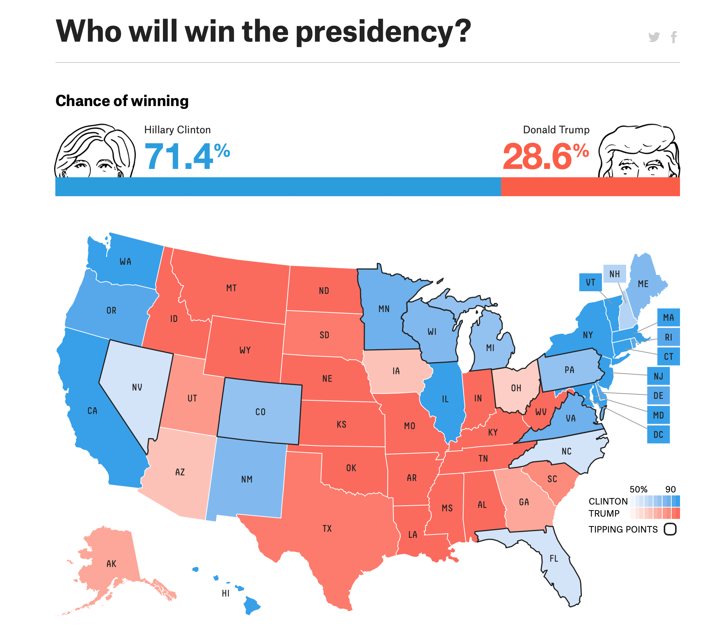

```{r include = FALSE}
knitr::opts_chunk$set(dpi = 300)
```


# Today

1. Statistics vs. Probability

2. Definition: what is "probability"?

3. Examples

4. Properties of Probabilities

5. Concepts
    * independence
    * conditional probabilities

---
layout: true

# Statistics vs. Probability

---

*Statistics* seeks to make inference about properties of a population based on a sample.

--

*Probability* takes information about a population, and allows us to make statements about random samples from said population.

---

**Example 1:**

We are trapped in an old underground chamber. There are five doors. We know that two of the doors lead to chambers with poisonous snakes (and immediate death), while the other three doors will take us straight to freedom. 

*Probability* can help us answer questions like "if we randomly pick a door, what is the probability we will survive?

--

**Example 2:**

We all decided to get really into ant farms. We have a big farm with 300 ants. Some of them are poisoneous, but we do not know how many. We take a random sample of 40 ants, and determine 8 of them are poisoneous. 

*Statistics* can help us answer questions like "what percentage of the ants are poisoneous?"

---

Important distinction between the two: 

* probability deals with the entire population, hence no uncertainty/randomness
    - can compute the exact probability of survival

* statistics deals with a sample, hence uncertainty/randomness
    - we can only provide a "guess" (called an *estimate*) as to what the true percentage of poisoneous ants is 
    
    - new sample -> new *estimate*

---
layout: true

# Probability Theory

**Definitions**

---

Will talk about probabilities in regards to outcomes of a *random process*/an *experiment*.

- we do not know the outcome before performing the experiment

- the *outcome* is the result we observe after performing the experiment

- an *event* is a collection of outcomes. 

---
layout: false

# Probability Theory

**Example:**

Consider the experiment "draw a card at random". 

Possible outcomes: 
--
 "Queen of Spades", "King of Hearts", "Three of Clubs", etc.

--

An event could be "the card is a King" -- this is the collection of four outcomes: "King of Spades", "King of Hearts", "King of Diamonds", "King of Clubs".

---
layout: true

# Probability Theory

---

Generally, two ways of thinking about probability: 

* Classical/frequentist interpretation

* Subjective/Bayesian/Degree of belief interpretation

--

We will solely focus on the former.

---

**Definition of Probability**

Two ways of thinking about probability in the frequentist framework. We will mainly use the second, but the first is included for completeness:

1. If all outcomes are equally likely, the *probability* of an event is 
$$P(\text{event}) = \frac{\text{number of outcomes in event}}{\text{total number of possible outcomes}}$$
2. The long run proportion of times the event occurs if the experiment is repeated an *infinite number of times*

---

**Example: roll a die**

Let $A = \{\text{roll is a 4}\}$, $B = \{\text{roll is a 1 or 5}\}$, and $C = \{\text{roll is even}\}$.

Use definition 1: 

$$P(\text{event}) = \frac{\text{number of outcomes in event}}{\text{total number of possible outcomes}}.$$

What is 

- $P(A)$, $P(B)$, and $P(C)$?

- $P(A \text{ OR } B)$, and $P(A \text{ OR } C)$? 

- $P(B \text{ and } C)$?

---
layout: true

# Probability Theory

**Example: Student Survey**

---

Consider the experiment: randomly select a student, and ask "do you like snow?"

Possible outcomes: yes, no, maybe.

What is $P(\text{yes})$?

--

Using definition 1: $P(\text{yes}) = \frac{1}{3}$. Does that sound right?

--

Of course not! Why does it fail?
--
 All outcomes are NOT equally likely.

--

Using definition 2: must repeat "an infinite number of times". Alright, let's do it!

---

We don't really have time for that, so let's simply do it "a very large number of times", and let's get a bit of help from `R`.

```{r include = FALSE, eval = FALSE}
library(tidyverse)
survey <- read_csv(here::here("csv_data/survey_cleaned.csv"))

snow_sample <- survey %>% 
  rename(snow = `Do you like snow?`) %>% 
  sample_n(size = 10000, replace = TRUE)

theme_set(theme_bw())

write_rds(snow_sample %>% rename(`Do you like snow?` = snow),
          path = here::here('Lectures/lecture04/snow_samples.Rds'))

is <- c(1:9, 
        seq(10, 90, by = 10),
        seq(100, 900, by = 100),
        seq(1000, 10000, by = 1000))

for(i in is){
  tmp <- snow_sample %>% 
    filter(row_number() <= i) %>% 
    janitor::tabyl(snow) %>% 
    mutate(snow = as.character(snow)) %>% 
    ggplot(aes(x = snow, y = percent)) +
      geom_bar(data = data.frame(x = c('yes','no', 'maybe'), y = c(0,0,0)),
               stat = 'identity',
               aes(x = x, y = y),
               alpha = 0) +
      geom_bar(stat = 'identity') + 
      geom_text(aes(label = n, y = 0.07),
                fontface = 'bold', size = 8) + 
      scale_y_continuous(limits = c(0,1), breaks = seq(0, 1, by = 0.1)) +
      labs(x = 'Do you like snow?', y = 'proportion',
           title = paste0('Number of repetitions:\n', i)) + 
      theme(plot.title = element_text(size = 18, face = 'bold'))
  
  ggsave(tmp, filename = here::here('Lectures/lecture04/snow_figure', paste0(str_pad(i, width = 5, side = 'left', pad = '0'), '0.jpg')),
         width = 4, height = 4)
  
  if(i <= 10)
    ggsave(tmp, filename = here::here('Lectures/lecture04/snow_figure', paste0(str_pad(i, width = 5, side = 'left', pad = '0'), '1.jpg')),
         width = 4, height = 4)
}

system("ffmpeg -framerate 2 -pattern_type glob -i 'snow_figure/*.jpg' -c:v libx264 snow_anim.mp4 -y")
```

<center>
  <video controls width="400" height="475">
    <source src="snow_anim.mp4" type="video/mp4">
  </video>
</center>

---

```{r message = FALSE, warning = FALSE}
library(tidyverse); theme_set(theme_bw())
snow_sample <- read_rds("snow_samples.Rds"); survey <- read_csv("../../csv_data/survey_cleaned.csv")
```


.pull-left[
Our sample of 10,000:

```{r message = FALSE, warning = FALSE}
snow_sample %>% 
  group_by(`Do you like snow?`) %>% 
  summarize(n = n()) %>% 
  mutate(Proportion = n / sum(n)) %>% 
  knitr::kable(format = "markdown",
               digits = 4)
```
]

.pull-right[
The entire population:

```{r message = FALSE, warning = FALSE}
survey %>% 
  group_by(`Do you like snow?`) %>% 
  summarize(n = n()) %>% 
  mutate(Proportion = n / sum(n)) %>% 
  knitr::kable(format = "markdown",
               digits = 4)
```
]

---

In reality, cannot/would not sample $10,000$ observations from this sample:
--

1. Too expensive

--

2. Might as well just ask the entire population, and find the Truth<sup>TM</sup>. 


--

This is simply to illustrate the idea of "long-run proportion". It is, indeed, an abstract idea, which is impossible to perform in practice, but helps us think about and interpret probabilities. 

---
layout: false

# Probability Theory

**Example: 2016 Election Prediction**

.center[
  
]

So how do we think about this kind of probability?

--

I go the "multiple universes" route... Alternatively, Bayesian but we won't go there.

---
layout: true

# Probability Theory

**Example: Student Survey**

---

Consider the experiment: randomly select a student, and ask "Are you a Packers fan?"

Possible outcomes: yes, no, maybe. What is $P(\text{yes})$?

--

Imagine we've asked 20 students, and got these replies:

```{r include = FALSE}
set.seed(1000)
```

.pull-left[
```{r sample-result, eval = FALSE}
sample_result <- survey %>% 
  sample_n(20) %>% 
  group_by(`Are you a Packers fan?`) %>% 
  summarize(n = n()) 

sample_result %>% 
  knitr::kable(format = "markdown")
```
]

.pull-right[
```{r echo = FALSE, ref.label="sample-result"}
```
]

How would we estimate $P(\text{yes})$?
--
 Simply $\frac{\text{n yes}}{\text{total}} = \frac{`r sample_result[sample_result[[1]] == 'yes','n']`}{20} = `r sample_result[sample_result[[1]]=='yes','n']/20`$

Is this the *exact* probability?
--
 No, because this comes from a sample, not the entire population.

---

This is a special case - we actually know the Truth<sup>TM</sup>, since we have surveyed the entire population. The true probability:

```{r}
survey %>% 
  group_by(`Are you a Packers fan?`) %>% 
  summarize(n = n()) %>% 
  mutate(Probability = n / sum(n)) %>% 
  knitr::kable(format = "markdown")
```

Our estimate is a bit off. How can we do better?
--
 Larger sample!

---

Moral of the story:

* probability = proportion of *entire population*

* "long run proportion" $\approx$ probability

* "infinite run proportion" == probability

If we wish to *estimate* (i.e. give our "best guess") the probability, repeat experiment many times. 

In practice, "number of experiments" is often thought of as "sample size". This is accurate if size of population is infinite. If limited, not quite...

---

Probabilities from histogram.

```{r out.height = "250px", out.width = "95%", fig.height = 2, fig.width = 5, fig.align = 'center'}
ggplot(data = survey,
       aes(x = `How tall are you? (In inches, please)`)) +
  geom_histogram(binwidth = 2.5, color = "black", 
                 boundary = 55, closed = 'right') +
  geom_text(stat = "bin", binwidth = 2.5, boundary = 55,            ## These two lines add the counts on top of the bars.
            closed = 'right', vjust = -1, aes(label = ..count..)) + ## Arguments binwidth, boundary, and closed must match the corresponding in the geom_histogram call
  scale_y_continuous(limits = c(0, 30)) +
  scale_x_continuous(breaks = seq(55, 79, by = 2.5))
```


---

$P(height < 61) = `r round(mean(survey[['How tall are you? (In inches, please)']] <= 61), digits = 4)`$

```{r echo = FALSE, out.width = "95%", fig.height = 2, fig.width = 5, fig.align = 'center'}
ggplot(data = survey,
       aes(x = `How tall are you? (In inches, please)`)) +
  geom_histogram(binwidth = 2.5, color = "black", 
                 boundary = 55, closed = 'right',
                 aes(fill = `How tall are you? (In inches, please)` < 61)) +
  geom_text(stat = "bin", binwidth = 2.5, boundary = 55,            ## These two lines add the counts on top of the bars.
            closed = 'right', vjust = -1, aes(label = ..count..)) + ## Arguments binwidth, boundary, and closed must match the corresponding in the geom_histogram call
  geom_text(data = data.frame(x = 56, y = 26, 
                              label = sum(!is.na(survey$`How tall are you? (In inches, please)`))),
            aes(x = x, y = y, label = paste("Total =", label)),
            hjust = 0, vjust = 1, size = 7) +
  scale_fill_manual(values = c("grey35", "red")) +
  guides(fill = 'none') +
  scale_y_continuous(limits = c(0, 30)) +
  scale_x_continuous(breaks = seq(55, 79, by = 2.5))
```

---

$P(height > 65) = `r round(mean(survey[['How tall are you? (In inches, please)']] > 65), digits = 4)`$

```{r echo = FALSE, out.width = "95%", fig.height = 2, fig.width = 5, fig.align = 'center'}
ggplot(data = survey,
       aes(x = `How tall are you? (In inches, please)`)) +
  geom_histogram(binwidth = 2.5, color = "black", 
                 boundary = 55, closed = 'right',
                 aes(fill = `How tall are you? (In inches, please)` > 65)) +
  geom_text(stat = "bin", binwidth = 2.5, boundary = 55,            ## These two lines add the counts on top of the bars.
            closed = 'right', vjust = -1, aes(label = ..count..)) + ## Arguments binwidth, boundary, and closed must match the corresponding in the geom_histogram call
  geom_text(data = data.frame(x = 56, y = 26, 
                              label = sum(!is.na(survey$`How tall are you? (In inches, please)`))),
            aes(x = x, y = y, label = paste("Total =", label)),
            hjust = 0, vjust = 1, size = 7) +
  scale_fill_manual(values = c("grey35", "red")) +
  guides(fill = 'none') +
  scale_y_continuous(limits = c(0, 30)) +
  scale_x_continuous(breaks = seq(55, 79, by = 2.5))
```

---

$P(62 < height \le 67.5) = `r round(mean(survey[['How tall are you? (In inches, please)']] > 62 & survey[['How tall are you? (In inches, please)']] <= 67.5), digits = 4)`$

```{r echo = FALSE, out.width = "95%", fig.height = 2, fig.width = 5, fig.align = 'center'}
ggplot(data = survey,
       aes(x = `How tall are you? (In inches, please)`)) +
  geom_histogram(binwidth = 2.5, color = "black", 
                 boundary = 55, closed = 'right',
                 aes(fill = `How tall are you? (In inches, please)` > 62 & `How tall are you? (In inches, please)` <= 67.5)) +
  geom_text(stat = "bin", binwidth = 2.5, boundary = 55,            ## These two lines add the counts on top of the bars.
            closed = 'right', vjust = -1, aes(label = ..count..)) + ## Arguments binwidth, boundary, and closed must match the corresponding in the geom_histogram call
  geom_text(data = data.frame(x = 56, y = 26, 
                              label = sum(!is.na(survey$`How tall are you? (In inches, please)`))),
            aes(x = x, y = y, label = paste("Total =", label)),
            hjust = 0, vjust = 1, size = 7) +
  scale_fill_manual(values = c("grey35", "red")) +
  guides(fill = 'none') +
  scale_y_continuous(limits = c(0, 30)) +
  scale_x_continuous(breaks = seq(55, 79, by = 2.5))
```


---

Alternatively 

\begin{align}
P(62 < height \le 67.5) &= \color{blue}{P(height \le 67.5)} - \color{brown}{P(height < 62)} \\
                        &= \color{blue}{`r round(mean(survey[['How tall are you? (In inches, please)']] <= 67.5),digits = 4)`} - \color{brown}{`r round(mean(survey[['How tall are you? (In inches, please)']] < 62), digits = 4)`} = 0.2451.
\end{align}

```{r echo = FALSE, fig.height = 2.75, fig.width = 5, fig.align = 'center'}
ggplot(data = survey %>% mutate(facet = '1'),
       aes(x = `How tall are you? (In inches, please)`)) +
  geom_histogram(data = survey %>% mutate(facet = '2'),
                 binwidth = 2.5, color = "black", 
                 boundary = 55, closed = 'right',
                 aes(fill = ifelse(`How tall are you? (In inches, please)` <= 67.5, "1", "0"))) +
  geom_histogram(data = survey %>% mutate(facet = '3'),
                 binwidth = 2.5, color = "black", 
                 boundary = 55, closed = 'right',
                 aes(fill = ifelse(`How tall are you? (In inches, please)` < 62, "2", "0"))) +
  geom_histogram(data = survey %>% mutate(facet = '1'),
                 binwidth = 2.5, color = "black", 
                 boundary = 55, closed = 'right',
                 aes(fill = ifelse(`How tall are you? (In inches, please)` <= 67.5 & `How tall are you? (In inches, please)` >= 62, "3", "0"))) +
  facet_grid(facet ~ .) +
  geom_text(stat = "bin", binwidth = 2.5, boundary = 55,            ## These two lines add the counts on top of the bars.
            size = 3, closed = 'right', vjust = -0.35, aes(label = ..count..)) + ## Arguments binwidth, boundary, and closed must match the corresponding in the geom_histogram call
  geom_text(data = data.frame(x = 56, y = 26, 
                              label = sum(!is.na(survey$`How tall are you? (In inches, please)`)),
                              facet = '1'),
            aes(x = x, y = y, label = paste("Total =", label)),
            hjust = 0, vjust = 1, size = 7) +
  scale_fill_manual(values = c("grey90", "blue", "brown", "black")) +
  guides(fill = 'none') +
  scale_y_continuous(limits = c(0, 30)) +
  scale_x_continuous(breaks = seq(55, 79, by = 2.5)) + 
  theme(strip.text = element_blank())
```


---
layout: true

# Probability Theory

**Properties**

---

1. The probability of an **event** is the sum of the probabilities of the outcomes in the event

2. The probability is a number between $0$ and $1$. **VERY IMPORTANT**
    1. Probability of $0$ means it can NEVER happen
    2. Probability of $1$ means it ALWAYS happens
    
3. The sum of the probabilities of all outcomes is $1$
    1. The probability of an event $A$ **NOT** happening is $1 - P(A)$. **VERY IMPORTANT**

---
layout: true

# Probability Theory

**Example: Student Survey**

---

What is $P(height > 62)$?

```{r echo = FALSE, out.height = "250px", out.width = "95%", fig.height = 2, fig.width = 5, fig.align = 'center'}
ggplot(data = survey,
       aes(x = `How tall are you? (In inches, please)`)) +
  geom_histogram(binwidth = 2.5, color = "black", 
                 boundary = 55, closed = 'right') +
  geom_text(stat = "bin", binwidth = 2.5, boundary = 55,            ## These two lines add the counts on top of the bars.
            closed = 'right', vjust = -1, aes(label = ..count..)) + ## Arguments binwidth, boundary, and closed must match the corresponding in the geom_histogram call
  geom_text(data = data.frame(x = 56, y = 26, 
                              label = sum(!is.na(survey$`How tall are you? (In inches, please)`))),
            aes(x = x, y = y, label = paste("Total =", label)),
            hjust = 0, vjust = 1, size = 7) +
  scale_y_continuous(limits = c(0, 30)) +
  scale_x_continuous(breaks = seq(55, 79, by = 2.5))
```

--

$P(height > 62) = 1 - P(height < 62) = 1 - 0.0294 = 0.9706$.

---
layout: true

# Probability Theory

**Important Concept: Conditional Probability**

---

Recall the experiment: randomly select a student, and ask "Are you a Packers fan?"

Possible outcomes: yes, no, maybe. What is $P(\text{yes})$?

This is a special case - we actually know the Truth<sup>TM</sup>, since we have surveyed the entire population. The true probability:

```{r}
survey %>% 
  group_by(`Are you a Packers fan?`) %>% 
  summarize(n = n()) %>% 
  mutate(Probability = n / sum(n)) %>% 
  knitr::kable(format = "markdown")
```

---

What if we had a bit more information: the student we just randomly selected grew up in Wisconsin. 

```{r wisc-packers}
survey %>% 
  filter(`What state did you grow up in?` == "wisconsin") %>% 
  group_by(`Are you a Packers fan?`) %>% 
  summarize(n = n()) %>% 
  mutate(Probability = n/sum(n)) %>% 
  knitr::kable(format = "markdown")
```

---

Or maybe they did not grow up in Wisconsin:

```{r}
survey %>% 
  filter(`What state did you grow up in?` != "wisconsin") %>% 
  group_by(`Are you a Packers fan?`) %>% 
  summarize(n = n()) %>% 
  mutate(Probability = n/sum(n)) %>% 
  knitr::kable(format = "markdown")
```

---

```{r echo = FALSE}
packers_probs <- survey %>% 
  count(State = `What state did you grow up in?` == "wisconsin", `Are you a Packers fan?`) %>% 
  group_by(State) %>% 
  mutate(prob = n/sum(n)) %>% 
  filter(`Are you a Packers fan?` == 'yes')
```


These are examples of "Conditional Probabilities". Notationally, we write $P(A | B)$ for the probability of $A$ given $B$.

The previous examples: 

* $P(\text{Packers fan} | \text{grew up in Wisconsin}) = `r filter(packers_probs, State)[['prob']]`$

* $P(\text{Packers fan} | \text{did NOT grow up in Wisconsin}) = `r filter(packers_probs, !State)[['prob']]`$

Generally, we can calculate these as $P(A | B) = \frac{P(A \text{ and } B)}{P(B)} = \frac{\# A \text{ and } B}{\# B}$.

---

```{r echo = FALSE}
state_OS <- survey %>% 
  mutate(State = case_when(`What state did you grow up in?` == 'wisconsin' ~ "Wisconsin", 
                           TRUE ~ "Other")) %>% 
  janitor::tabyl(`What operating system do you use?`, State) %>% 
  janitor::adorn_totals(where = c('row', 'col'))

state_OS %>% knitr::kable(format = "markdown")
```

$P(\text{OS = macOS} | \text{Grew up in Wisconsin}) =$
--
 $\frac{\#\text{{OS = macOS} AND {Grew up in Wisconsin}}}{\# \text{ Grew up in Wisconsin}} = \frac{9}{48} = 0.1875$.

--
 
$P(\text{Did not grow up in Wisconsin} | \text{OS = Windows}) =$
--
 $\frac{\#\text{{Did not grow up in Wisconsin} AND {OS = Windows}}}{\# \text{OS = Windows}} = \frac{31}{68} \approx 0.4559$.


---
layout: true

# Probability Theory

**Most Important Concept: Independence**

---

In the "grew up in Wisconsin?" and "Packers fan?" example, knowing the origin of the student drastically changed the probability of getting a "yes" to the question. 

When this is the case, we say the two variables are *dependent*. 

If this is not the case, we say the two variables are *independent*. 

Independence is crucial in many parts of statistics, since it dramatically simplifies the math.

---
 
Recall: in practice, "number of experiments" is thought of as "sample size". This is accurate if size of population is infinite. If limited, not quite... Why not?

--

Consider a deck of cards. Draw a sample of size 20. Is the 20th "experiment" really a repetition of the 1st? 
--
 No, because the possible outcomes change!

--

If we have thousands of decks of cards and draw a sample of size 20, then you could argue that the 20th is approximately the same experiment as the 1st.

--

In real life, never "sample with replacement". So, if population is small, hard to repeat "many times". Generally not a practical problem... unless you are dealing with survey data from a small population.

--

When we say "repeat the experiment many times", we really mean "repeat the experiment many times independent of each other"! Very, **VERY** important!

---

**Example**

Are operating system and origin independent?

$P(\text{OS = macOS} | \text{from Wisconsin}) = \frac{9}{48} = 0.1875$.

$P(\text{OS = macOS} | \text{NOT from Wisconsin}) = \frac{22}{54} \approx 0.4074$.

So, not independent. 

--

Although technically correct, hard to use in practice. Changes are that even truly independent events will seem to be dependent. 

--

Therefore, independence of observations is often an *assumption* we make, and have to defend. To assume independence is a subjective decision. 


---

Remember, in general $P(A | B) = \frac{P(A \text{ and } B)}{P(B)}$. 

If $A$ and $B$ are independent, then $P(A | B) = P(A)$ and $P(B | A) = P(B)$. In words, "knowing $B$ provides no information about $A$", and vice versa. 

So, if $A$ and $B$ are independent, then 

$$
P(A) = P(A | B) = \frac{P(A \text{ and } B)}{P(B)}.
$$

So, if $A$ and $B$ are independent: $P(A) P(B) = P(A \text{ and } B)$.

---

**Example**

Are the observations independent?

1. A die is rolled. It is a 4. What is the probability the die will be a 4 when rolled again?

--
    * The two rolls are independent

--
2. From a standard 52 deck of cards, a card is chosen. It is the 3 of hearts. A second card is chosen. Will the outcome of the second card be independent of the first?

--
    * No. The probability changes because we do not put the card back in the deck.

--
3. Randomly pick an NBA player. Ask them to shoot 10 free throws. Are the outcomes of the 10 free throws independent?

--
    * Maybe... I would argue yes. 

---

**Example**

Calculating probabilities of independent events:

>A mine safety chamber has a battery operated telephone and a chemical oxygen generator, each of which must work for the chamber to help the miners after an accident. The phone fails $1\%$ of the time and the generator fails $5\%$ of the time, and these failures are independent. What is the probability that the chamber will be helpful after an accident?

--

$$P(\text{phone works AND generator works}) = P(\text{phone works})\cdot P(\text{generator works})$$

Since $P(\text{phone works}) = 1 - P(\text{phone fails}) = 1 - 0.01 = 0.99$ and $P(\text{generator works}) = 1 - P(\text{generator fails}) = 1 - 0.05 = 0.95$, 

\begin{align}
P(\text{phone works} AND \text{generator works}) &= 0.99\cdot 0.95 = `r 0.99*0.95`
\end{align}

